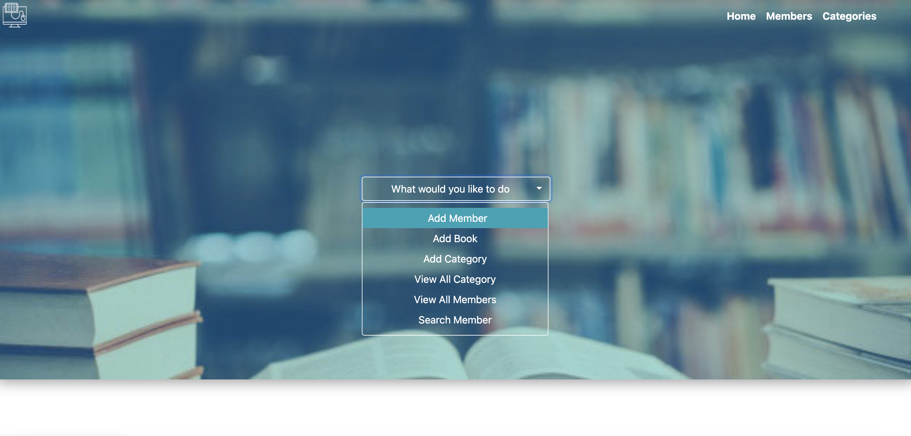
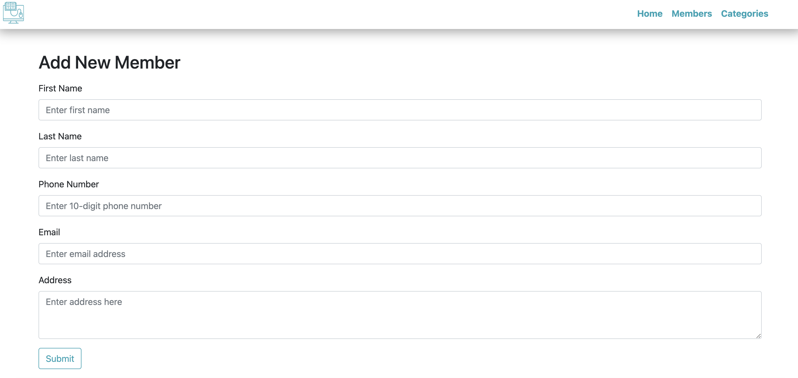
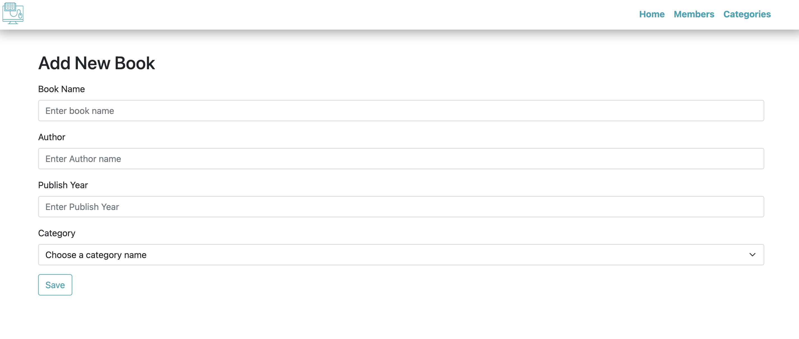
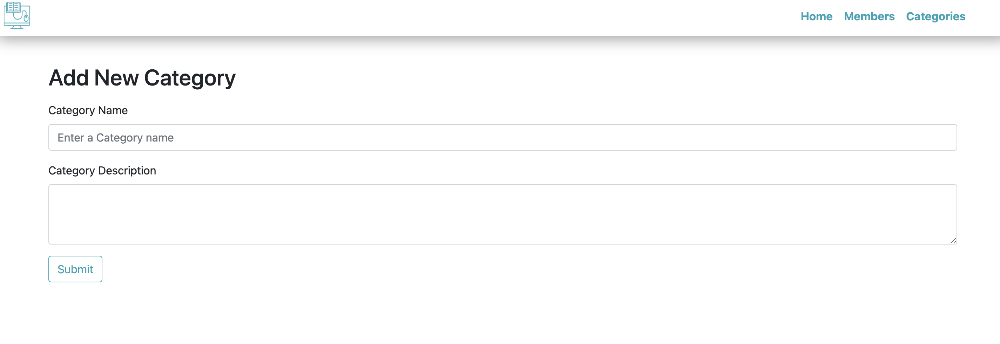
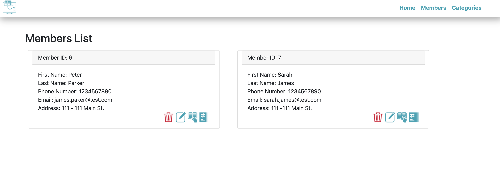
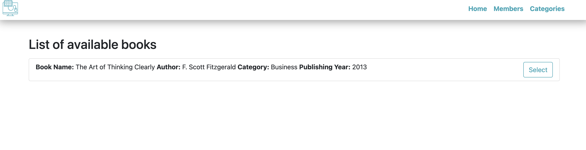
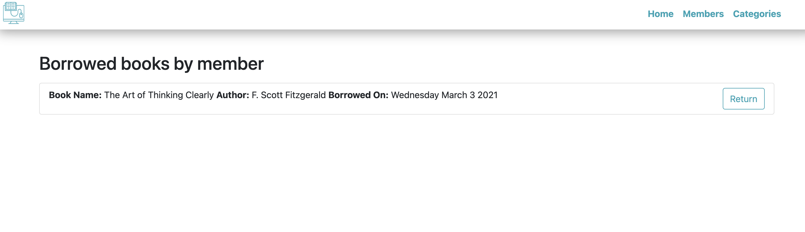

<h1 align="center", margin="2%">                     📚   Library Management System 📚</h1>

[][M] 

[M]:https://opensource.org/licenses/MIT

<h1>Description</h1>

    To build a management system that helps in handling the primary functions of libraries that involves 
    maintaining the database for entering new books and recording books that have been borrowed by members

<h1> Table of Contents </h1>

* [Demo](#Demo)

* [Installation](#installation)
  
* [Usage](#usage)

* [Features](#Features)

* [License](#license)

* [Participants](#Participants)

* [Deployed](#Deployed)

* [Questions](#Questions)

## Demo:

## Installation:
    1️⃣ Clone repository to your local ✔
    2️⃣ Run npm packages in (package.json) file ✔
    3️⃣ Copy code inside schema.sql file and run it in your mySQL server ❗️
    4️⃣ Copy seed.sql code and run it in your mySQL ❗️
    5️⃣ Run 'Node server' or 'npm start' to start application ✔
    
##  Usage:
    1️⃣ After running server ✔
    2️⃣ Add a member to library ✔
    3️⃣ Check the category list that you are interested ✔   
    4️⃣ Click member list and click barrow book icon under your name ✔
    5️⃣ After reading book click return book icon under your name ✔

##  License:
    This project is licensed under the MIT license.

    For more information about the license, click on the link below.

<h1>

  

©  [][M]

[M]: https://opensource.org/licenses/mit

</h1>

## Participants:

1️⃣ [Faisal Nour](https://github.com/faisalsnour)

2️⃣ [Fatih AY](https://github.com/fatihay53)

3️⃣ [Siyuan Huo](https://github.com/siyuanhuo)

4️⃣ [Illias Chowdhury](https://github.com/iliasc8)

5️⃣ [Muhammad Alim](https://github.com/muhammadalim5)

## Deployed:

[][H]

[H]:https://library-management-system-lms.herokuapp.com

## Questions:
   
<h1 align="center">

     For questions ❓ 

                              
[][1]
[][2]
[][3] 

[1]: https://github.com/fatihay53
[2]: https://www.linkedin.com/in/fatih-sultan-ay-211689181
[3]: mailto:f.sultanay@gmail.com

</h1>

